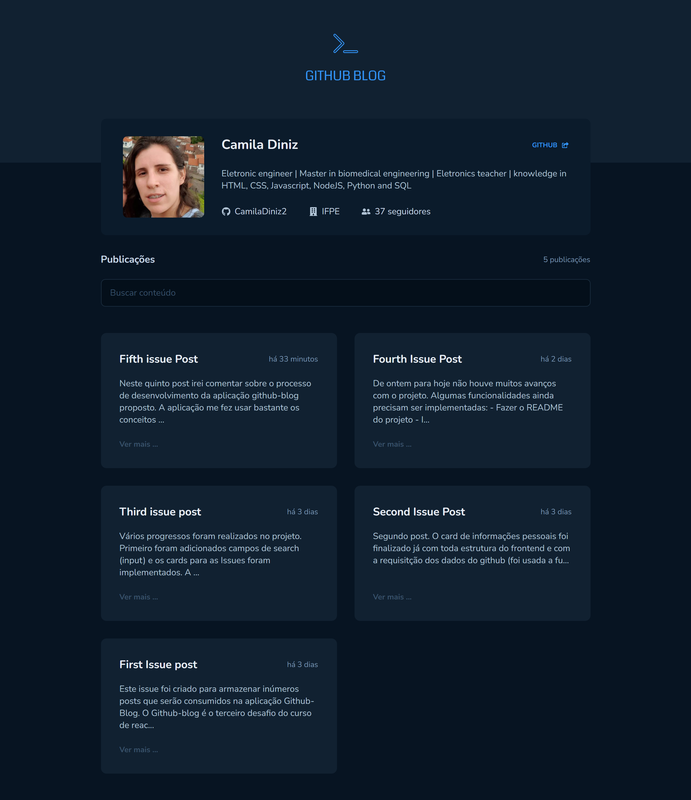
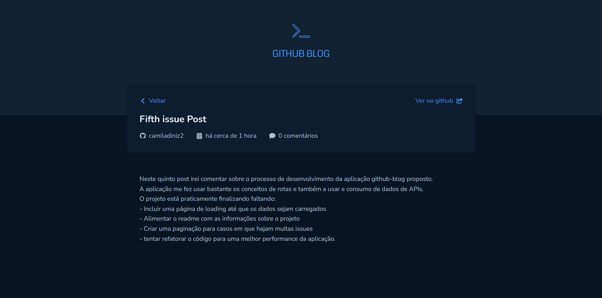
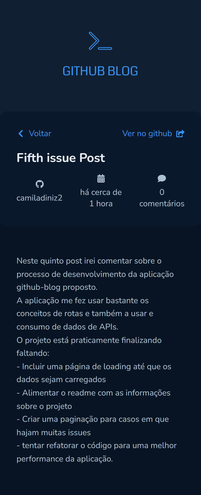

# Github Blog

## Sumário

1. Introdução
2. Ferramentas utilizadas
3. Setup
4. Desenvolvimento

## 1. Introdução

Ete é o Github-blog, terceiro desafio proposto no curso de React, trilha Ignite da [Rocketseat](https://www.rocketseat.com.br/).

## 2. Ferramentas utilizadas

Neste projeto serão usadas as seguintes ferramentas/bibliotecas/conceitos:

- Fetch/Axios
- Roteamento e React Router DOM
- Formulários

### 3. Setup

3.1 Acesse o seguinte link: [Github-blog](https://github.com/CamilaDiniz2/github-blog)

3.2 Clique em "Use this template"

3.3 Faça um clone do repositório

3.4 E para baixar todas s dependencia digite "npm install"

### 4. Desenvolvimento

4.1 A tela de Home
As telas foram criadas para ter um comportamento responsivo como é possível observar nas imagens de um desktop e em uma tela mobile.

Tela de Home - Desktop

Tela de Home - Mobile

4.2 Tela para especificar uma Issue
Nesta tela também foram criadas páginas responsivas.

Tela de especificação de uma Issue - Desktop

Tela de especificação de uma Issue - Mobile

